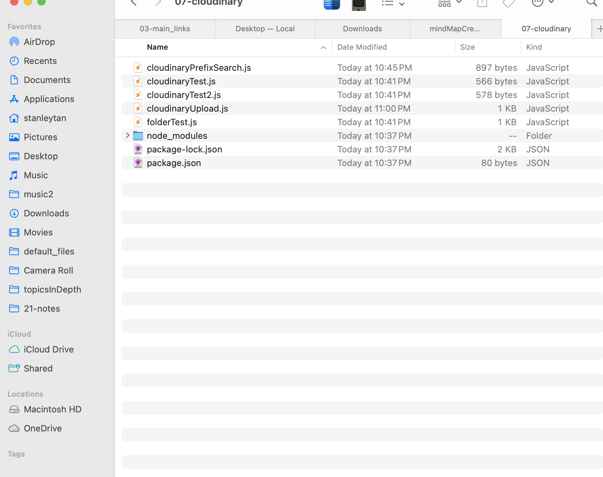
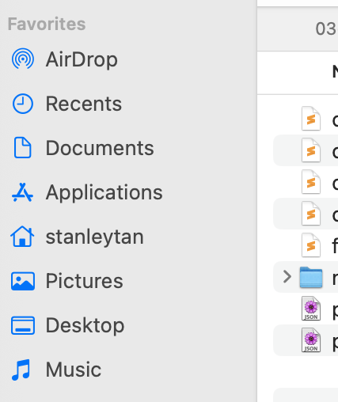
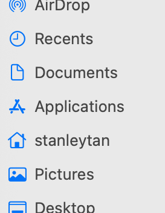

# Cloudinary Upload Utilities

This repository contains Node.js utilities for uploading and managing images with Cloudinary. The scripts handle single file uploads, batch uploads, and searching for uploaded resources.

## Files Overview

### cloudinaryUpload.js
Single file upload utility with optional folder organization.

**Usage:**
```bash
node cloudinaryUpload.js <file-path> [folder-path]
```

**Examples:**
```bash
node cloudinaryUpload.js "sample.jpg"                    # Upload to root
node cloudinaryUpload.js "sample.jpg" "test1"            # Upload to test1 folder  
node cloudinaryUpload.js "sample.jpg" "home/test1"       # Upload to home/test1 folder
node cloudinaryUpload.js "image.png" ""                  # Upload to root (empty folder)
```

**Features:**
- Uses original filename as public ID
- Supports folder organization
- Auto-detects file type
- Displays upload details (URL, size, dimensions)

### cloudinaryBatchUpload.js
Batch upload utility for uploading multiple images from a local folder.

**Usage:**
```bash
node cloudinaryBatchUpload.js <local-folder> [cloudinary-folder]
```

**Examples:**
```bash
node cloudinaryBatchUpload.js "./images"                                    # Upload all .png/.jpg to root
node cloudinaryBatchUpload.js "./photos" "gallery"                         # Upload all .png/.jpg to gallery folder
node cloudinaryBatchUpload.js "/path/to/images" "clipboard"                # Upload all .png/.jpg to clipboard folder
```

**Features:**
- Supports PNG, JPG, JPEG files (case-insensitive)
- Progress tracking with success/failure counts
- Parallel uploads for efficiency
- Summary report after completion

### cloudinaryPrefixSearch.js
Search and export utility for finding Cloudinary resources by prefix.

**Usage:**
```bash
node cloudinaryPrefixSearch.js "prefix" [txt-file]
```

**Examples:**
```bash
node cloudinaryPrefixSearch.js "Screenshot"           # Search and save URLs
node cloudinaryPrefixSearch.js "" "output.txt"        # Process existing txt file to markdown
```

**Features:**
- Searches up to 100 resources by prefix
- Saves URLs to output.txt
- Generates markdown format with image links
- Copies markdown to clipboard (macOS)
- Can process existing URL lists from text files

### cloudinaryTest2.js
Simple test utility to list recent uploads from your Cloudinary account.

**Usage:**
```bash
node cloudinaryTest2.js
```

**Features:**
- Lists last 10 uploaded resources
- Displays URL, Public ID for each resource
- Basic connectivity test for Cloudinary API

## Sample Images in Directory

The following test images are included in this directory:

 testImage1.png: Sample test image 1

 testImage2.png: Sample test image 2

 testImage3.png: Sample test image 3

## Setup

1. Install dependencies:
```bash
npm install dotenv cloudinary glob
```

2. Create a `.env` file with your Cloudinary credentials:
```
CLOUDINARY_CLOUD_NAME=your_cloud_name
CLOUDINARY_API_KEY=your_api_key
CLOUDINARY_API_SECRET=your_api_secret
```

## Dependencies

- **dotenv**: Environment variable management
- **cloudinary**: Cloudinary SDK for Node.js
- **glob**: File pattern matching for batch operations
- **path**: Built-in Node.js path utilities
- **fs**: Built-in Node.js filesystem operations
- **child_process**: Used for clipboard operations (macOS)

## Common Use Cases

1. **Single Image Upload**: Use `cloudinaryUpload.js` for uploading individual files
2. **Bulk Upload**: Use `cloudinaryBatchUpload.js` for uploading entire image folders
3. **Finding Images**: Use `cloudinaryPrefixSearch.js` to locate and export images by naming pattern
4. **Quick Test**: Use `cloudinaryTest2.js` to verify your Cloudinary connection and see recent uploads